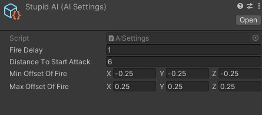

# 3D Unity shooter template

## About

### The controls are defined at top-left corner of the screen

### Features:

- Ready for online (checking local/not local player)
- Ready command-system (on player input)
- Flexible design
- Several weapons
- Match-type picking
- Passive abilities and their affect on player systems

## SCREENS:

